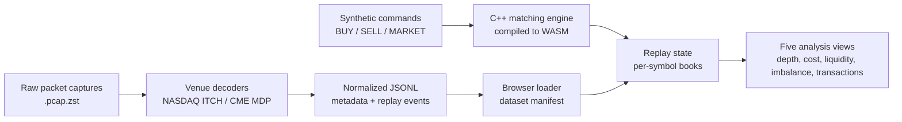
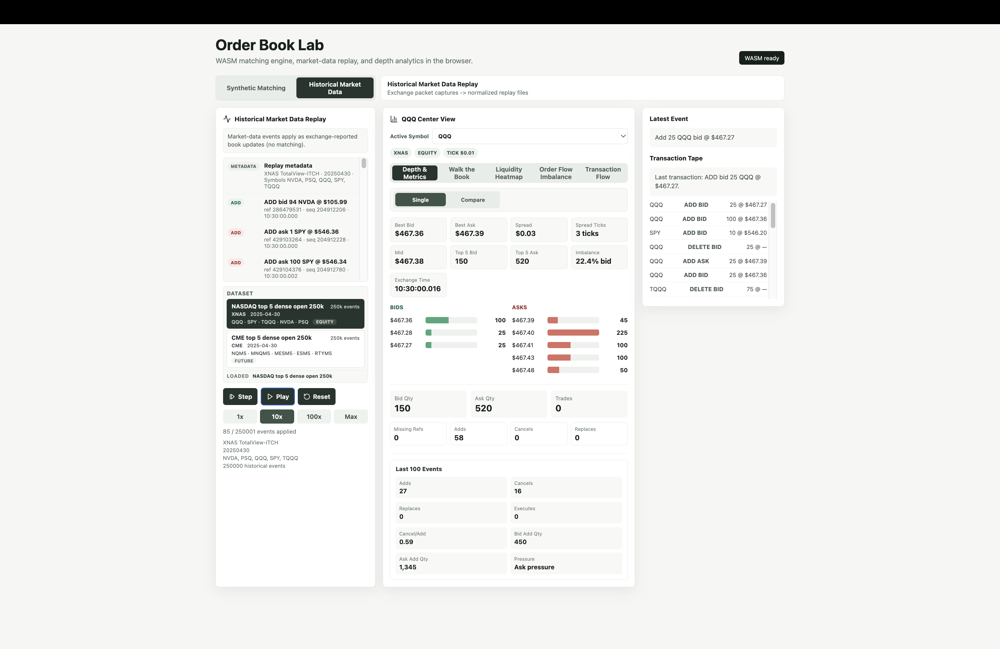
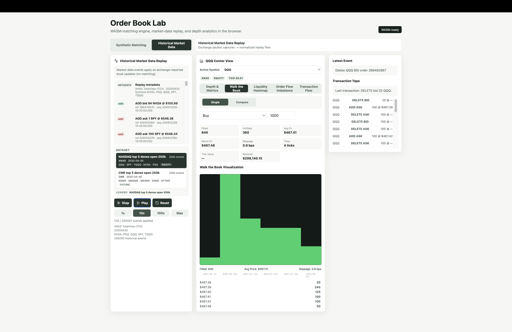
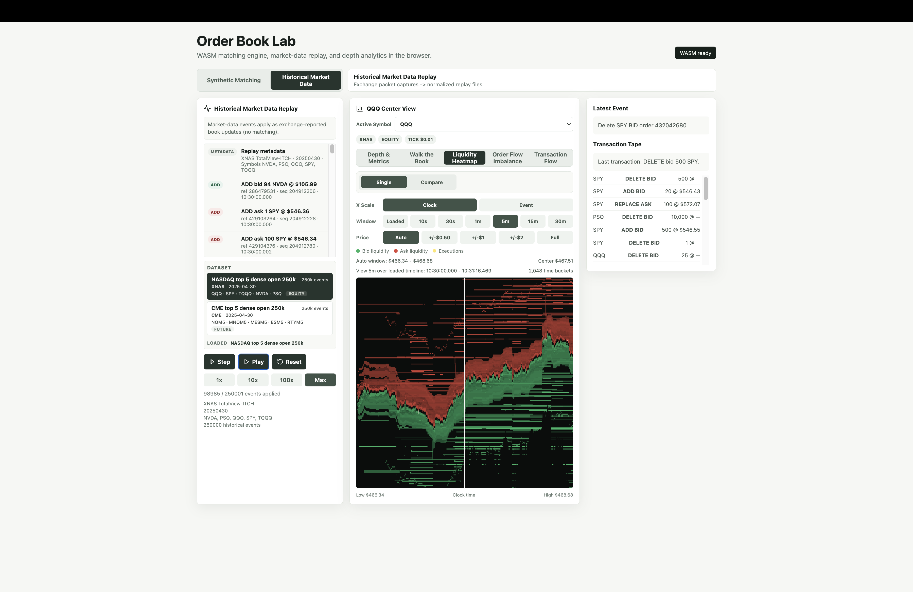
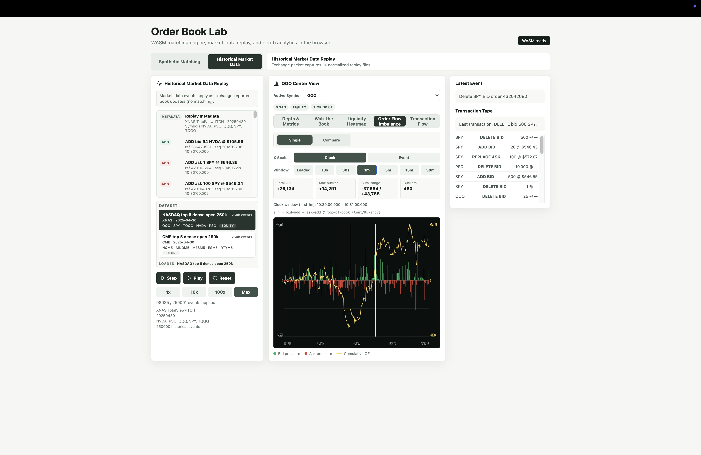
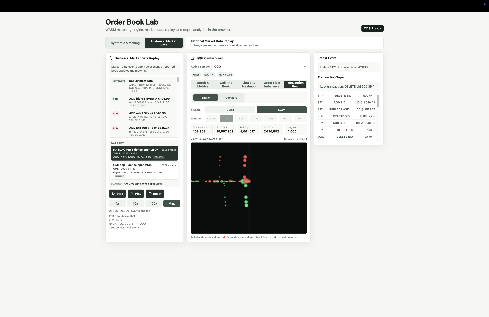
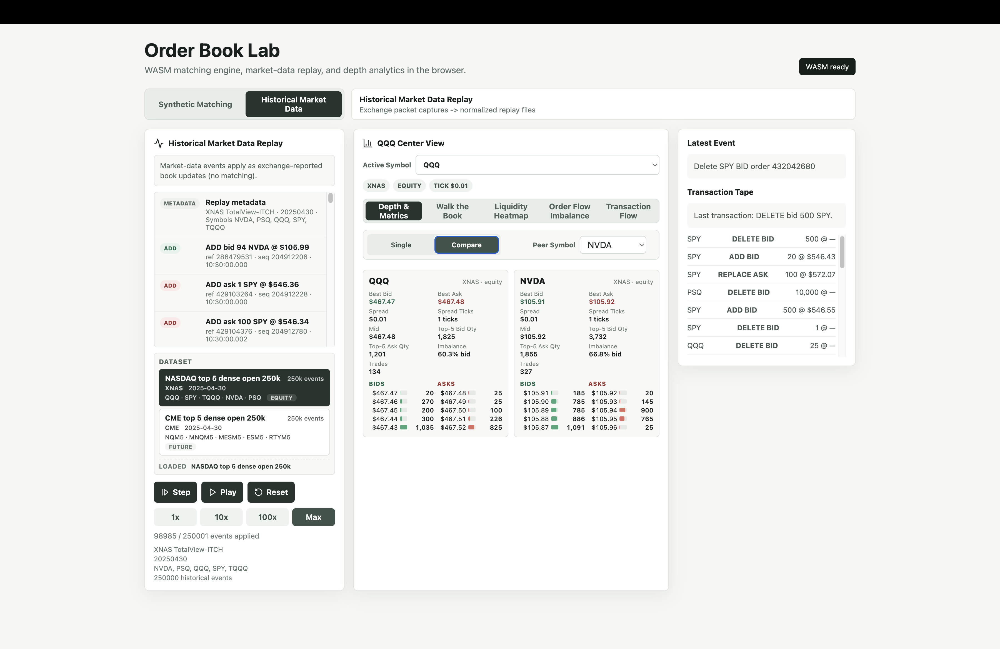

# Order Book Lab Final Report

Group 11 - IE 421: High Frequency Trading  
Spring 2026

## 1. Executive Summary

Order Book Lab is a browser-based market microstructure tool. It replays synthetic orders, loads historical market data, reconstructs order books, and visualizes what is happening inside the book.

The basic idea is simple: price charts only show where the market traded. Traders also care about liquidity, spread, slippage, imbalance, and transaction flow. Our goal was to make those hidden parts of the market visible.

The final product includes:

- A C++ matching engine compiled to WebAssembly.
- A React/Vite browser interface.
- Historical replay support for normalized NASDAQ and CME market data.
- Five visualization tabs for depth, execution cost, liquidity, imbalance, and transaction flow.
- Per-tab comparison mode for active symbol vs peer symbol.

At a high level, Order Book Lab shows what happens behind the price you see on a chart. When people buy and sell in a market, there is a constantly changing queue of available buyers and sellers at different prices. This project turns that fast-moving queue into something visible and interactive. Instead of only seeing that a price moved, a user can see how much liquidity was available, how quickly it changed, and how different products behaved at the same moment. The app can replay real market data so the viewer is not just looking at a made-up example. It also lets users compare two symbols side by side, which makes patterns easier to spot. The result is a tool that makes a complicated part of financial markets easier to explain, explore, and demonstrate.

## 2. Architecture

The system has two main paths.

Synthetic mode routes user-created commands through the C++ matching engine. Historical mode applies exchange-reported market-data events to reconstruct books over time.

The historical pipeline is:

1. Start with raw `.pcap.zst` exchange packet captures.
2. Decode venue-specific market-data protocols.
3. Normalize useful events into JSONL.
4. Load the JSONL file in the browser.
5. Rebuild per-symbol order books.
6. Render analytics and visualizations from the replay state.

This separation matters. Synthetic matching is useful for testing order-book behavior. Historical replay is useful for studying what the market actually reported.

## 3. Data And Schema

The final demo uses two dense historical datasets from the same trading date.

**NASDAQ dataset**

- Venue: XNAS
- Source format: TotalView-ITCH packet captures
- Date: 2025-04-30
- Symbols: QQQ, SPY, TQQQ, NVDA, PSQ
- Size: 250,000 replay events

**CME dataset**

- Venue: CME
- Source format: CME MDP market-data packet captures
- Date: 2025-04-30
- Symbols: NQM5, MNQM5, MESM5, ESM5, RTYM5
- Size: 250,000 replay events

Each normalized JSONL file starts with a metadata row. That row describes the venue, symbols, asset class, price scale, tick size, and instrument information. After that, each row is a replay event such as an add, cancel, delete, replace, execution, or level update.

One important lesson was that intermittent sampling is not enough for this kind of replay. If we skip too many events, the book state becomes less coherent. Dense sequential slices give a much better picture of the actual trading period.

## 4. Visualization Layer

The UI is built around five analysis views. Each view answers a different trading question.

### Depth & Metrics

Shows best bid, best ask, spread, mid price, top-of-book depth, and imbalance.

This is the fastest way to answer: how liquid is this symbol right now?

### Walk The Book

Simulates taking liquidity from the visible book. It reports filled quantity, average price, worst price, slippage, ticks, and notional impact.

This answers: what would this trade actually cost?

### Liquidity Heatmap

Shows liquidity across time and price. Bid depth, ask depth, and execution activity become easier to scan visually.

This answers: where is liquidity appearing or disappearing?

### Order Flow Imbalance

Aggregates event pressure into bid-side and ask-side imbalance. It makes directional pressure easier to see than reading raw event rows.

This answers: is pressure building on one side of the book?

### Transaction Flow

Shows market activity as a transaction/event flow visualization. It is useful for seeing bursts of activity and the rhythm of the replay.

This answers: when is the market most active?

### Comparison Mode

Each tab supports a contextual Single / Compare control. Compare mode shows the active symbol against one peer symbol.

We chose per-tab comparison instead of one separate comparison page because each visualization has different scaling needs. For example, QQQ and NQM5 should not be overlaid on one price axis.

## 5. Results And Key Takeaways

The final build works as a complete browser demo with 500,000 bundled dense historical replay events across 10 symbols from NASDAQ and CME. The app supports both equity and futures metadata, runs the C++ order-book engine in the browser through WebAssembly, and presents the replay through five visualization modes plus contextual comparison. This gave us a final product that is not only technically functional, but also easy to explain visually.

The biggest takeaway is that raw market data only becomes useful after normalization and replay design. The hard part is not only parsing packets. It is turning those events into a coherent book state and then into visuals that people can understand quickly.

## 6. Conclusions And Future Work

Order Book Lab makes market microstructure visible. It is not a production trading system, but it is a strong education, demo, and research foundation. The project combines low-level market-data normalization, C++ order-book logic, WebAssembly deployment, and browser-based visual analytics into one usable tool.

The most important result is that the final product connects the full path from raw exchange packet data to an interactive visual interface. That makes the project more than a parser or a frontend demo by itself. It shows how packet-level data can become a replayable market state, and how that state can be explored through tools that are understandable to both technical and non-technical viewers.

Future work:

- Add a BYO packet-capture importer.
- Stream larger datasets instead of loading the full JSONL file into memory.
- Support more venues and market-data protocols.
- Add exportable analytics reports.
- Build deeper execution-cost and liquidity-regime metrics.

## 7. Team

### Drake Bartolai

I am a Computer Engineering student graduating in May 2027. After graduation, I plan to pursue a career in trading, engineering, or technology consulting. Long-term, I want to found and run my own business in a field I am passionate about, including education, sports, technology, and finance. I enjoy building tools that I personally find useful, and I am currently learning how to make and distribute tools that other people find useful as well. On this project, I mainly focused on the core architecture, WebGL visualizations, overall product design, and the structure that made the demo feel like a cohesive tool.

Contact:

- GitHub: [github.com/dbartolai](https://github.com/dbartolai)
- LinkedIn: [linkedin.com/in/drake-bartolai](https://www.linkedin.com/in/drake-bartolai/)
- Email: [drakeab2@illinois.edu](mailto:drakeab2@illinois.edu)
- Personal site: [bartolai.com](https://bartolai.com)
